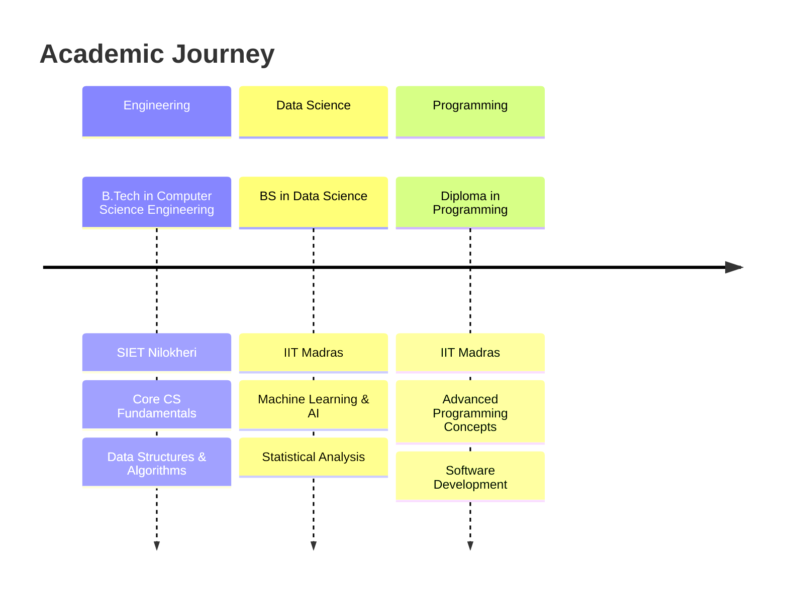

<div align="center">

# 🔥 Welcome to My Digital Universe 🔥


[](https://portfolio-git-main-nitesh-sharmas-projects-3b96572d.vercel.app/)
[](https://github.com/NITESHBHARDWAJ001)
[](mailto:niteshsharmans775@gmail.com)

</div>

---

<div align="center">

## ⚡ About Me ⚡


</div>

```typescript
const nitesh = {
    name: "Nitesh Sharma",
    role: "AI-Powered Full Stack Developer",
    education: ["B.Tech CSE (SIET Nilokheri)", "BS Data Science (IIT Madras)", "Diploma Programming (IIT Madras)"],
    specialization: ["MERN/PERN Stack", "Python + Java + C/C++", "ML/AI", "Competitive Programming"],
    achievements: ["🏆 CDAC Delhi Hackathon Winner", "⭐ HackerRank 5★ Python", "🌟 GSSOC 2025 Contributor"],
    currentFocus: "Building scalable AI-powered applications",
    openFor: "Freelance Projects & Full-time Opportunities"
};
```

---

<div align="center">

## 🧠 Skills & Tech Arsenal 🧠


### 🔮 Languages


### ⚡ Frameworks & Libraries


### 🗄️ Databases


### 🛠️ Tools & Platforms


</div>

---

<div align="center">

## 🚀 Featured Projects 🚀


</div>

<table align="center" style="border: none;">
<tr>
<td width="50%" align="center">

### 🌱 Plant Nursery Management & Ecommerce


**Tech Stack:** MERN, Tailwind CSS, Recharts, PDFKit, Twilio  
**Impact:** Auto Purchase Orders • Smart Stock Velocity • Complete ERP Solution  
**Features:** Admin Dashboards • Billing System • Real-time Reports

</td>
<td width="50%" align="center">

### 🎓 Smart Campus Portal (ERP System)


**Tech Stack:** MERN, JWT Authentication, Role-based Access  
**Impact:** Streamlined campus operations for 1000+ users  
**Features:** Course Management • Attendance Tracking • Placement Portal

</td>
</tr>
<tr>
<td width="50%" align="center">

### 🌍 EcoFinds – Sustainable Marketplace


**Tech Stack:** React, Flask, JWT, RESTful APIs  
**Impact:** Promoting sustainable commerce  
**Features:** Product CRUD • Cart System • Order History

</td>
<td width="50%" align="center">

### 🔍 Crime Analysis & Reporting System


**Tech Stack:** AI/ML, Python, Web Technologies  
**Impact:** Smart crime pattern detection using AI  
**Features:** Citizen Reporting • ML Severity Scoring • Hotspot Analysis

</td>
</tr>
<tr>
<td width="50%" align="center" colspan="2">

### 🧠 Quiz Master (Advanced Quiz Platform)


**Tech Stack:** Vue.js, Flask, Celery, Email Integration  
**Impact:** Intelligent quiz management system  
**Features:** Timed Quizzes • User Analytics • Email Notifications

</td>
</tr>
</table>

---

<div align="center">

## 🎯 What I Do 🎯


</div>

```yaml
Core Expertise:
  🔥 Full Stack Development: "Building end-to-end web applications with modern tech stacks"
  🤖 AI/ML Integration: "Implementing intelligent features in web applications"
  ⚡ Performance Optimization: "Creating fast, scalable, and responsive applications"
  🛠️ System Architecture: "Designing robust backend systems and APIs"
  📱 Responsive Design: "Crafting beautiful UIs that work on all devices"
  🔒 Security Implementation: "Ensuring secure authentication and data protection"
  📊 Data Analytics: "Building dashboards and reporting systems"
  🚀 DevOps & Deployment: "Docker, CI/CD, and cloud deployment strategies"
```

---

<div align="center">

## 📊 GitHub Analytics 📊


</div>

---

<div align="center">

## 🏆 Achievements & Recognition 🏆


</div>

<div align="center">

[](https://github.com/NITESHBHARDWAJ001)

### 🌟 Major Accomplishments

🏆 **CDAC Delhi Hackathon Winner** - Team: MERN Marverkers  
🥇 **Multiple Hackathon Finalist** - Consistent top performer  
⭐ **HackerRank 5★ Python** - Elite programming skills  
🌟 **GSSOC 2025 Contributor** - Open source excellence  
🎓 **Dual Degree Holder** - B.Tech CSE + BS Data Science (IIT Madras)  

</div>

---

<div align="center">

## 🎓 Education Excellence 🎓



</div>

---

<div align="center">

## 🧩 Competitive Programming 🧩


</div>

<div align="center">

[](https://www.hackerrank.com/)
[]()
[]()

**🔥 5-Star Python Developer on HackerRank**  
**⚡ Consistent problem solver across multiple platforms**  
**🏆 Strong foundation in Data Structures & Algorithms**

</div>

---

<div align="center">

## 🤝 Open For Collaboration 🤝


</div>

<div align="center">

### 💼 Professional Opportunities

🚀 **Freelance Projects** - Ready to build your next big idea  
💻 **Full-time Positions** - Seeking challenging software development roles  
🤝 **Open Source Contributions** - Always excited to contribute to meaningful projects  
📚 **Mentorship** - Happy to guide fellow developers  

### 🎯 I'm Perfect For

✅ **Full Stack Web Applications**  
✅ **AI/ML Integration Projects**  
✅ **E-commerce Solutions**  
✅ **ERP & Management Systems**  
✅ **API Development & Integration**  
✅ **Performance Optimization**  

</div>

---

<div align="center">

## 📬 Let's Connect & Build Something Amazing 📬


</div>

<div align="center">

<a href="https://portfolio-git-main-nitesh-sharmas-projects-3b96572d.vercel.app/" target="_blank">
  
</a>

<a href="https://github.com/NITESHBHARDWAJ001" target="_blank">
  
</a>

<a href="mailto:niteshsharmans775@gmail.com" target="_blank">
  
</a>

<a href="https://www.linkedin.com/in/nitesh-sharma/" target="_blank">
  
</a>

</div>

---

<div align="center">


**🖤 "Code is poetry written in logic, and every bug is just a plot twist waiting to be resolved." 🖤**


</div>

---

<div align="center">
  
*⭐ From [Nitesh Sharma](https://github.com/NITESHBHARDWAJ001) - Building the future, one commit at a time ⭐*

</div>
